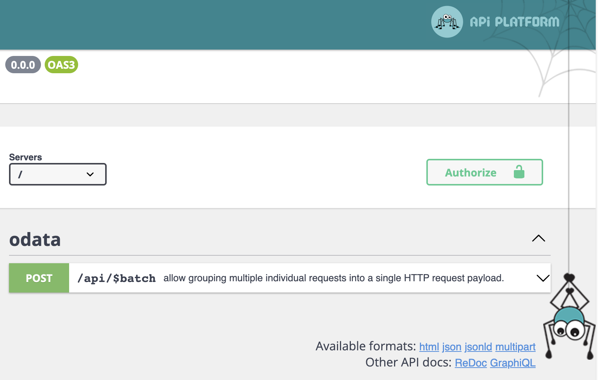
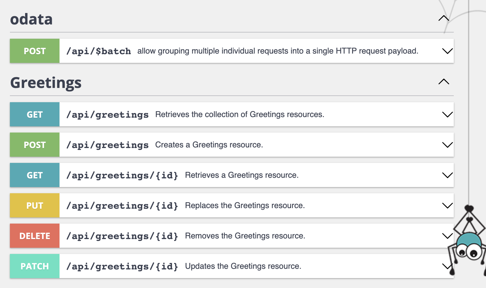

# Batch request with API-Platform

## What are we working on, and why ? 

There are some reasons that might push you toward sending multiple request at once.
To mention some of them, you could be on HTTP/1.1 and circumvent the lack of pipelining, 
or you are in HTTP/2 or HTTP/3, and you need to ensure a group of requests is executed altogether or not at all,*
or you would need a certain sequentiality in such that you could use the result of a previous action within a second.*

* There are better ways to achieve this.
* Again, there are better ways to achieve this.

We are talking of Batch Request.
In common tongue it means, One request to rule them all, one request to find them, One request to bring them all, and in the darkness bind them.

In Api-platform, this is achievable by modifying two thing in your configuration.

```yaml
api_platform:
    # ...
    formats:
        # ...
        multipart: ['multipart/mixed'] # allow multipart/mixed requests
    odata:
        batch_endpoint: ~ # activate the Odata Batch endpoint
```

By doing so, you know have a new endpoint accessible and visible in your OpenApi documentation.



Although, Swagger UI allows you to sandbox your API and send requests from the interface, it is not really meant to 
be used for multipart requests initialy, which means, you don't have enough control over the headers. You can use it, 
but I wouldn't recommend it.

Let's have a traditional HTTP resource as well.
The magnificent `Greetings`.

```php
<?php
// src/entity/Greetings.php
declare(strict_types=1);

namespace App\Entity;

use ApiPlatform\Metadata\ApiResource;
use Doctrine\ORM\Mapping as ORM;

#[ORM\Entity()]
#[ApiResource]
class Greetings
{
    #[ORM\Id]
    #[ORM\GeneratedValue]
    #[ORM\Column(type: 'integer')]
    private $id;

    #[ORM\Column(type: 'string', length: 255)]
    private $name;

    public function getId(): ?int
    {
        return $this->id;
    }

    public function getName(): ?string
    {
        return $this->name;
    }

    public function setName(string $name): void
    {
        $this->name = $name;
    }
}
```



Lets begin with a simple / not so simple batch request.
In a single batch, we are going to ask for a collection, which should be empty.
Then include a second batch in which we insert a new Greeting resource, and asl for the collection again, that should 
contains our newly created resource.

```HTTP
POST /api/$batch HTTP/1.1
Host: localhost:8000
Accept: multipart/mixed
Content-Type: multipart/mixed;boundary=abc
Content-Length: 700

This is the preamble.  It is to be ignored, though it
is a handy place to include an explanatory note to non-MIME compliant readers.

--abc
GET /api/greetings HTTP/1.1
Host: localhost:8000
Accept: application/ld+json

--abc
POST /api/$batch HTTP/1.1
Host: localhost:8000
Content-Type: multipart/mixed;boundary=def

This is also a preamble.  It is to be ignored.
--def
POST /api/greetings HTTP/1.1
Host: localhost:8000
Accept: application/ld+json
Content-Type: application/ld+json

{
	"name": "Greg"
}

--def
GET /api/greetings HTTP/1.1
Host: localhost:8000
Accept: application/ld+json

--def--
This is also an epilogue. It is to be ignored as well.

--abc--
This is the epilogue. It is to be ignored.
```

Use your favourite HTTP client to execute this request :)
and : 

```HTTP
--3VAWXC23
HTTP/1.1 200 OK
Cache-Control:          no-cache, private
Content-Type:           application/ld+json; charset=utf-8
Date:                   Thu, 11 Aug 2022 12:26:33 GMT
Etag:                   "5919f19cfb4c284d1e7f580cf8b40e19"
Vary:                   Accept
X-Content-Type-Options: nosniff
X-Debug-Token:          fdae1a
X-Debug-Token-Link:     https://localhost:8000/_profiler/fdae1a
X-Frame-Options:        deny
X-Robots-Tag:           noindex

{"@context":"\/api\/contexts\/Greetings","@id":"\/api\/greetings","@type":"hydra:Collection","hydra:member":[{"@id":"\/api\/greetings\/1","@type":"Greetings","id":1,"name":"Greg"}],"hydra:totalItems":1}
--3VAWXC23
HTTP/1.1 200 OK
Cache-Control:          no-cache, private
Content-Type:           multipart/mixed; boundary=A7SZAzLe
Date:                   Thu, 11 Aug 2022 12:26:33 GMT
Vary:                   Accept
X-Content-Type-Options: nosniff
X-Debug-Token:          4ce9da
X-Debug-Token-Link:     https://localhost:8000/_profiler/4ce9da
X-Frame-Options:        deny
X-Robots-Tag:           noindex

--A7SZAzLe
HTTP/1.1 201 Created
Accept-Patch:           application/merge-patch+json
Cache-Control:          no-cache, private
Content-Location:       /api/greetings/2
Content-Type:           application/ld+json; charset=utf-8
Date:                   Thu, 11 Aug 2022 12:26:33 GMT
Location:               /api/greetings/2
Set-Cookie:             sf_redirect=%7B%22token%22%3A%22415156%22%2C%22route%22%3A%22_api_%5C%2Fgreetings.%7B_format%7D_post%22%2C%22method%22%3A%22POST%22%2C%22controller%22%3A%22api_platform.action.placeholder%22%2C%22status_code%22%3A201%2C%22status_text%22%3A%22Created%22%7D; path=/; secure; httponly; samesite=lax
Vary:                   Accept
X-Content-Type-Options: nosniff
X-Debug-Token:          415156
X-Debug-Token-Link:     https://localhost:8000/_profiler/415156
X-Frame-Options:        deny
X-Robots-Tag:           noindex

{"@context":"\/api\/contexts\/Greetings","@id":"\/api\/greetings\/2","@type":"Greetings","id":2,"name":"Greg"}
--A7SZAzLe
HTTP/1.1 200 OK
Cache-Control:          no-cache, private
Content-Type:           application/ld+json; charset=utf-8
Date:                   Thu, 11 Aug 2022 12:26:33 GMT
Etag:                   "ce7574602c44fea0ece312c152767991"
Vary:                   Accept
X-Content-Type-Options: nosniff
X-Debug-Token:          4a031d
X-Debug-Token-Link:     https://localhost:8000/_profiler/4a031d
X-Frame-Options:        deny
X-Robots-Tag:           noindex

{"@context":"\/api\/contexts\/Greetings","@id":"\/api\/greetings","@type":"hydra:Collection","hydra:member":[{"@id":"\/api\/greetings\/1","@type":"Greetings","id":1,"name":"Greg"},{"@id":"\/api\/greetings\/2","@type":"Greetings","id":2,"name":"Greg"}],"hydra:totalItems":2}
--A7SZAzLe--

--3VAWXC23--

```

You would have then noticed the followings:

- Supports layered batch requests
- Each sub operation has its own Request within the stack
- Each Request then have its own profiler
- Everything is observable from the main batch request
- Its build of the very same foundation of any operation so it could use any operation option available to some extent

Now, for the most curious of you, how does this work?
This is where our journey begins.

Http Requests.

## What is an HTTP Request?

Here are exerpts of what is an HTTP Request from https://www.w3.org/Protocols/rfc2616/rfc2616-sec5.html :

A request message from a client to a server includes, within the first line of that message, the method to be applied to the resource, the identifier of the resource, and the protocol version in use.

```
Request= Request-Line
        *(( general-header 
         | request-header  
         | entity-header ) CRLF)  
        CRLF
        [ message-body ]   
```

### Request-Line

The Request-Line begins with a method token, followed by the Request-URI and the protocol version, and ending with CRLF. The elements are separated by SP characters. No CR or LF is allowed except in the final CRLF sequence.

```
Request-Line   = Method SP Request-URI SP HTTP-Version CRLF
```

####  Method

The Method token indicates the method to be performed on the resource identified by the Request-URI. The method is case-sensitive.

```
Method  = "OPTIONS"  
          | "GET"      
          | "HEAD"     
          | "POST"     
          | "PUT"      
          | "DELETE"   
          | "TRACE"    
          | "CONNECT"  
          | extension-method
extension-method = token
```

The list of methods allowed by a resource can be specified in an Allow header field. The return code of the response always notifies the client whether a method is currently allowed on a resource, since the set of allowed methods can change dynamically. An origin server SHOULD return the status code 405 (Method Not Allowed) if the method is known by the origin server but not allowed for the requested resource, and 501 (Not Implemented) if the method is unrecognized or not implemented by the origin server. The methods GET and HEAD MUST be supported by all general-purpose servers. All other methods are OPTIONAL.

#### Request-URI

The Request-URI is a Uniform Resource Identifier and identifies the resource upon which to apply the request.

```
Request-URI    = "*" | absoluteURI | abs_path | authority
```

The four options for Request-URI are dependent on the nature of the request. The asterisk "*" means that the request does not apply to a particular resource, but to the server itself, and is only allowed when the method used does not necessarily apply to a resource. One example would be

```
OPTIONS * HTTP/1.1
```

The absoluteURI form is REQUIRED when the request is being made to a proxy. The proxy is requested to forward the request or service it from a valid cache, and return the response. Note that the proxy MAY forward the request on to another proxy or directly to the server

specified by the absoluteURI. In order to avoid request loops, a proxy MUST be able to recognize all of its server names, including any aliases, local variations, and the numeric IP address. An example Request-Line would be:

```
GET https://www.w3.org/ HTTP/1.1
```

To allow for transition to absoluteURIs in all requests in future versions of HTTP, all HTTP/1.1 servers MUST accept the absoluteURI form in requests, even though HTTP/1.1 clients will only generate them in requests to proxies.

The authority form is only used by the CONNECT method.

The most common form of Request-URI is that used to identify a resource on an origin server or gateway. In this case the absolute path of the URI MUST be transmitted as the Request-URI, and the network location of the URI (authority) MUST be transmitted in a Host header field. For example, a client wishing to retrieve the resource above directly from the origin server would create a TCP connection to port 80 of the host "www.w3.org" and send the lines:

```
GET /standards/semanticweb/ HTTP/1.1
Host: www.w3.org
```

followed by the remainder of the Request. Note that the absolute path cannot be empty; if none is present in the original URI, it MUST be given as "/" (the server root).

If the Request-URI is encoded using the "% HEX HEX" encoding [42], the origin server MUST decode the Request-URI in order to properly interpret the request. Servers SHOULD respond to invalid Request-URIs with an appropriate status code.

A transparent proxy MUST NOT rewrite the "abs_path" part of the received Request-URI when forwarding it to the next inbound server, except as noted above to replace a null abs_path with "/".

```
Note: The "no rewrite" rule prevents the proxy from changing the
meaning of the request when the origin server is improperly using
a non-reserved URI character for a reserved purpose.  Implementors
should be aware that some pre-HTTP/1.1 proxies have been known to
rewrite the Request-URI.
```

### The Resource Identified by a Request

The exact resource identified by an Internet request is determined by examining both the Request-URI and the Host header field.

An origin server that does not allow resources to differ by the requested host MAY ignore the Host header field value when determining the resource identified by an HTTP/1.1 request.

An origin server that does differentiate resources based on the host requested (sometimes referred to as virtual hosts or vanity host names) MUST use the following rules for determining the requested resource on an HTTP/1.1 request:

1. If Request-URI is an absoluteURI, the host is part of the Request-URI. Any Host header field value in the request MUST be ignored.
2. If the Request-URI is not an absoluteURI, and the request includes a Host header field, the host is determined by the Host header field value.
3. If the host as determined by rule 1 or 2 is not a valid host on the server, the response MUST be a 400 (Bad Request) error message.

Recipients of an HTTP/1.0 request that lacks a Host header field MAY attempt to use heuristics (e.g., examination of the URI path for something unique to a particular host) in order to determine what exact resource is being requested.

### Request Header Fields

The request-header fields allow the client to pass additional information about the request, and about the client itself, to the server. These fields act as request modifiers, with semantics equivalent to the parameters on a programming language method invocation.

```
request-header = Accept     
               | Accept-Charset    
               | Accept-Encoding   
               | Accept-Language   
               | Authorization     
               | Expect     
               | From
               | Host
               | If-Match   
              
               | If-Modified-Since 
               | If-None-Match     
               | If-Range   
               | If-Unmodified-Since      
               | Max-Forwards      
               | Proxy-Authorization      
               | Range      
               | Referer    
               | TE  
               | User-Agent 
```

Request-header field names can be extended reliably only in combination with a change in the protocol version. However, new or experimental header fields MAY be given the semantics of request- header fields if all parties in the communication recognize them to be request-header fields. Unrecognized header fields are treated as entity-header fields.

### How can we manipulate this in our favour?

The goal is to send this bit of information, multiple times at once, within the same request. First reflex, If I have the idea, others must have too (before).

## Gathering technical specification

- https://datatracker.ietf.org/doc/html/draft-snell-http-batch-01
- https://www.w3.org/Protocols/rfc1341/7_2_Multipart.html
- https://www.odata.org/documentation/#stq=batch&stp=1
  - http://docs.oasis-open.org/odata/odata/v4.01/odata-v4.01-part1-protocol.html#sec_BatchRequests
  - http://docs.oasis-open.org/odata/odata/v4.01/odata-v4.01-part1-protocol.html#sec_Preferencecontinueonerrorodatacontin
  - http://docs.oasis-open.org/odata/odata/v4.01/odata-v4.01-part1-protocol.html#sec_Preferencerespondasync
- https://developers.google.com/gmail/api/guides/batch
- https://developers.google.com/people/v1/batch
- https://cloud.google.com/storage/docs/batch
- https://developers.googleblog.com/2018/03/discontinuing-support-for-json-rpc-and.html
- https://www.npmjs.com/package/google-api-batch-utils
- https://www.doctrine-project.org/projects/doctrine-dbal/en/latest/reference/transactions.html#transaction-nesting

## First ideas

IETF, is usually a good place to start, and James M. Snell (An IBM engineer who also worked on PATCH method, prefer header, Json Merge Patch, etc.) propose a draft to handle batch requests.

In the big lines it propose this:
- Send everything in one endpoint
- The endpoint use multipart/http Content-Type header
- Each sub request is described in the payload, separated by a boundary string
- Each sub request is identified by a Content-ID to associate the responses
- We cannot assume the order of execution of each sub request
- The main request cannot be cached, but sub-requests might

Moreover, **each sub request has it's own authentication and authorization**.  

A batched request must not inherit the authentication/authorization of the containing Multipart Batch Request or the other requests in the batch. Just because a
user is authorized to submit a batch of requests, that doesn't mean
they are authorized to submit any of the individually batched requests.

That is a good start but still a draft.
Let's dive into this multipart Content-Type.

### Multipart Content-Type

A typical multipart Content-Type header field might look like this:

```
Content-Type: multipart/mixed;
boundary=gc0p4Jq0M2Yt08jU534c0p
```

This indicates that the entity consists of several parts, each itself with a structure that is syntactically identical to an RFC 822 message, except that the header area might be completely empty, and that the parts are each preceded by the line:

```
--gc0p4Jq0M2Yt08jU534c0p
```

This string can be any string.

As a very simple example, the following multipart message has two parts, both of them plain text, one of them explicitly typed and one of them implicitly typed:

```
From: Nathaniel Borenstein <nsb@bellcore.com> 
To:  Ned Freed <ned@innosoft.com> 
Subject: Sample message 
MIME-Version: 1.0 
Content-type: multipart/mixed; boundary="simple 
boundary" 

This is the preamble.  It is to be ignored, though it 
is a handy place for mail composers to include an 
explanatory note to non-MIME compliant readers. 
--simple boundary 

This is implicitly typed plain ASCII text. 
It does NOT end with a linebreak. 
--simple boundary 
Content-type: text/plain; charset=us-ascii 

This is explicitly typed plain ASCII text. 
It DOES end with a linebreak. 

--simple boundary-- 
This is the epilogue.  It is also to be ignored.
```

Multipart/Mixed means it could be anything.
But there are other subtypes.

- Multipart/alternative (used for emails for example)
- Multipart/digest (variation of mixed to contain multiple messages (mostly for emails))
- Multipart/parallel (parts are intended to be presented in parallel, i.e., simultaneously, on hardware and software that are capable of doing so)

And a part can itself be Multipart.

We know a bit better how it could be done, lets see how others did.

### Google Gmail Batch API

In their documentation, it's fairly similar to the IETF draft.
Nothing much to add really.

### OData

This one propose something more comple(te|xe) that the previous ones.
It has the same foundations, with these additions and differences:

- Allow request dependencies
- Entities created by an insert request MAY be referenced in the request URL of subsequent requests
- The service MAY support using values from a response body in the query part of the URL or in the request body of subsequent requests
- The service MAY support the use of an ETag returned from a previous operation in an If-Match or If-None-Match header of a subsequent statement
- The service MUST process the individual requests and change sets within a multipart batch request in the order received. **Processing stops on the first error unless the continue-on-error preference is specified with an explicit or implicit value of true**.
- **a service MUST successfully process and apply all the requests in the change set or else apply none of them**.

In addition, Odata has been standardized by OASIS and approved as an ISO/IEC International Standard.

This is definitively the layer, I want to build the grounds on.

## What's good to know about PHP ?

Before diving into any code, lets do a review of what's possible to do with PHP as-is these days.

We need to be able to parse the HTTP request, and extract each part. 
Everything that has been sent must be extracted.

Using the CLI to proceed any call is pointless, mostly because we won't use it, but especially because the PHP CLI does not support GET, POST or file uploads.
Again, we don't really care since we expect it to be executed from a server perspective.

What do we want exactly? We want to grab the all HTTP request and parse it.
This is not possible in PHP.
There isn't any API offered by the language to get the original HTTP request in our hands.
Everything has been processed by FCGI to be accessed from the global variables.

In conclusion, we need then to use everything PHP gives us, but also parse the body, explode it in new sub-requests.

Because a mixed multipart HTTP request might have recursively subpart boundaries,
and because one might theoretically contain files and therefor increase the memory substantially, we cannot just grab the full body and parse it without risking memory issues.

We need to use a resource stream.

Let's have a look in the different supported Protocols and Wrappers in PHP:

```
file://
http://
ftp://
php://
zlib://
data://
glob://
phar://
php://
ssh2://
rar://
ogg://
expect://
```

Within the `php://` you can access various I/O streams that allow access to PHP's own input and output streams, the standard input, output and error file descriptors, in-memory and disk-backed temporary file streams, and filters that can manipulate other file resources as they are read from and written to.

```
php://stdin
php://stdout
php://stderr
php://input
php://output
php://fd
php://memory
php://temp
php://filter
```

`php://stdin`, `php://stdout` and `php://stderr` allow direct access to the corresponding input or output stream of the PHP process. The stream references a duplicate file descriptor, so if you open `php://stdin` and later close it, you close only your copy of the descriptor-the actual stream referenced by `STDIN` is unaffected. It is recommended that we simply use the constants `STDIN`, `STDOUT` and `STDERR` instead of manually opening streams using these wrappers.

`php://stdin` is read-only (ok) and `php://input` is a read-only stream that allows you to read raw data from the request body (ok too). `php://input` is not available with `enctype="multipart/form-data"`.

But by chance `multipart/mixed` is what's expected from Odata specification which PHP is fine with.

With API Platform, the HTTP request starts its journey through the Symfony runtime component.

`index -> autoload_runtime -> SymfonyRuntime -> Request::createFromGlobals`


From there, the request provides a getContent method which accept an `$asResource` argument.

I will cover `application/x-www-form-urlencoded` but wouldn't recommend it, mostly because of this https://url.spec.whatwg.org/#application/x-www-form-urlencoded :

```
The application/x-www-form-urlencoded format is in many ways an aberrant monstrosity, the result of many years of implementation accidents and compromises leading to a set of requirements necessary for interoperability, but in no way representing good design practices. In particular, readers are cautioned to pay close attention to the twisted details involving repeated (and in some cases nested) conversions between character encodings and byte sequences. Unfortunately the format is in widespread use due to the prevalence of HTML forms.
```

PHP isn't designed to handle multi-parts aside from files,
and to my knowledge, there isn't any good HTTP Parser written in PHP.
Time to scout over the internet, see if it's still the case.

I've found an 8 years old library, too simplistic and incomplete,
and one that wasn't touch for months, few stars... kind of scary BUT!
There are 2 known contributors in it :

**Tobias Nyholm:**
Symfony Core team, certified Symfony developer. Speaker, writer, podcaster. Maintainer for many awesome libraries.

and

**Nuno Maduro:**
Software engineer at @laravel — working on Laravel, Forge, and Vapor. Created @pestphp, @laravel-zero, collision, larastan, php insights, termwind, and more...

Maybe worth having a look.

https://github.com/Riverline/multipart-parser  
The package is used in bref, laravel, firebase, or phpleague.

Also there is https://github.com/Toflar/http-request-parser but this one is more a single request parser.

I think the riverline one is nice and could be used, but I also know that in API Platform there is the will to reduce the amount of dependencies. This is something that could be part of HttpFoundation component.

Anyway I'll implement mine for the time being. All the basic logic takes place within the OdataBatchProcessor.
To keep this document simple I won't cover the implementation details.

```PHP
<?php

declare(strict_types=1);

namespace ApiPlatform\Odata\State;

use ApiPlatform\Http\MediaTypeFactoryInterface;
use ApiPlatform\Metadata\Operation;
use ApiPlatform\Mime\Part\Multipart\BatchPart;
use ApiPlatform\Mime\Part\Multipart\PartConverter;
use ApiPlatform\Mime\Part\Multipart\PartsExtractor;
use ApiPlatform\State\ProcessorInterface;
use Symfony\Component\HttpFoundation\RequestStack;
use Symfony\Component\HttpFoundation\Response;
use Symfony\Component\HttpKernel\Exception\BadRequestHttpException;
use Symfony\Component\HttpKernel\HttpKernelInterface;
use Symfony\Component\Mime\Part\Multipart\MixedPart;

final class OdataBatchProcessor implements ProcessorInterface
{
    private PartConverter $partConverter;

    public function __construct(private RequestStack $requestStack, private HttpKernelInterface $httpKernel, private MediaTypeFactoryInterface $mediaTypeFactory)
    {
        $this->partConverter = new PartConverter();
    }

    public function process($data, Operation $operation, array $uriVariables = [], array $context = [])
    {
        if (null === $currentRequest = $this->requestStack->getCurrentRequest()) {
            throw new BadRequestHttpException('No request found to process.');
        }

        $batchParts = [];

        // extract each part from the STDIN
        foreach ((new PartsExtractor($this->mediaTypeFactory))->extract($currentRequest) as $subPart) {
            $response = $this->httpKernel->handle(
                // Convert each part into a subRequest and send it
                $this->partConverter->toRequest($subPart, $currentRequest), HttpKernelInterface::SUB_REQUEST, false
            );
    
            // Store the response in HTTP string format with a Batch Mime part.
            $batchParts[] = new BatchPart((string) $response->prepare($currentRequest));
        }

        // Create a Mime MixedPart
        $mixedPart = new MixedPart(...$batchParts);

        // Prepare the Response 
        $headers = [
            'Content-Type' => sprintf('%s; charset=utf-8', $mixedPart->getPreparedHeaders()->get('Content-Type')->getBodyAsString()),
            'Vary' => 'Accept',
            'X-Content-Type-Options' => 'nosniff',
            'X-Frame-Options' => 'deny',
        ];

        // Send it :)
        return new Response(
            $mixedPart->bodyToString(),
            $operation->getStatus(),
            $headers
        );
    }
}

```

We have the foundations.
Let's implement the Odata specifications now.

## Odata specifications

>Batch requests allow grouping multiple individual requests into a single HTTP request payload. An individual request in the context of a batch request is a Metadata Request, Data Request, Data Modification Request, Action invocation request, or Function invocation request.
>
>Batch requests are submitted as a single HTTP POST request to the batch endpoint of a service, located at the URL $batch relative to the service root.
>
>Individual requests within a batch request are evaluated according to the same semantics used when the request appears outside the context of a batch request.
>
>A batch request is represented using either the multipart batch format defined in this document or the JSON batch format defined in [OData-JSON](http://docs.oasis-open.org/odata/odata-json-format/v4.01/odata-json-format-v4.01.html#sec_BatchRequest).

I'll use the classic HTTP representation, but allowing the json format could definitely be a must-have!

### Batch Request Headers

> A batch request using the multipart batch format **MUST** contain a Content-Type header specifying a content type of multipart/mixed and a boundary parameter as defined in [RFC 2046](http://docs.oasis-open.org/odata/odata/v4.01/odata-v4.01-part1-protocol.html#RFC2046).

Done.

> Batch requests **SHOULD** contain the applicable OData-Version header.

At the moment we only support the version 4.*, I won't bother handling multiple versions yet.

> Batch requests **SHOULD** contain an Accept header specifying the desired batch response format, either multipart/mixed or application/json. If no Accept header is provided, services **SHOULD** respond with the content type of the request.

First, I went to support the multipart/mixed content-type with a boundary parameter within a standard HTTP Request. Using the JSON format, is possible too, and might be the one perduring. I'll implement it as well later.

> If the set of request headers of a batch request are valid the service MUST return a 200 OK HTTP response code to indicate that the batch request was accepted for processing, but the processing is yet to be completed. The individual requests within the body of the batch request may subsequently fail or be malformed; however, this enables batch implementations to stream the results.

> If the service receives a batch request with an invalid set of headers it MUST return a 4xx response code and perform no further processing of the batch request.

Nothing too fancy, Symfony `HttpFoundation` component has a `StreamedResponse` class.
